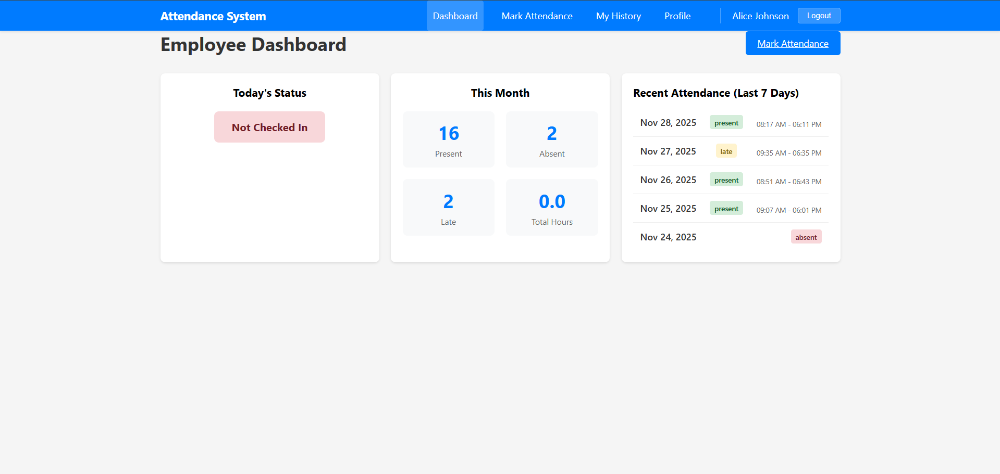
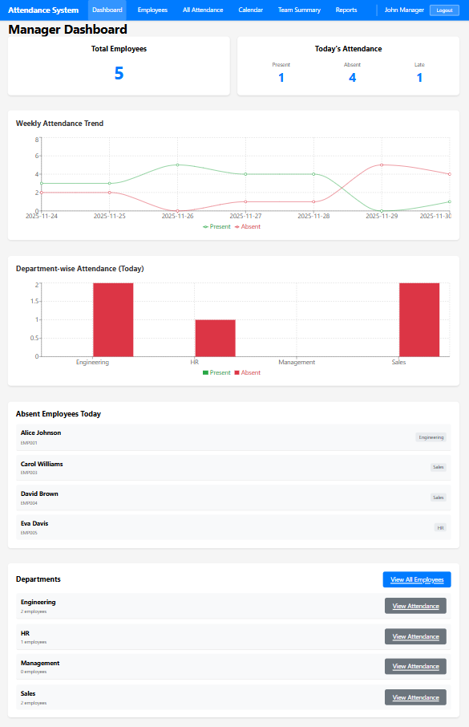
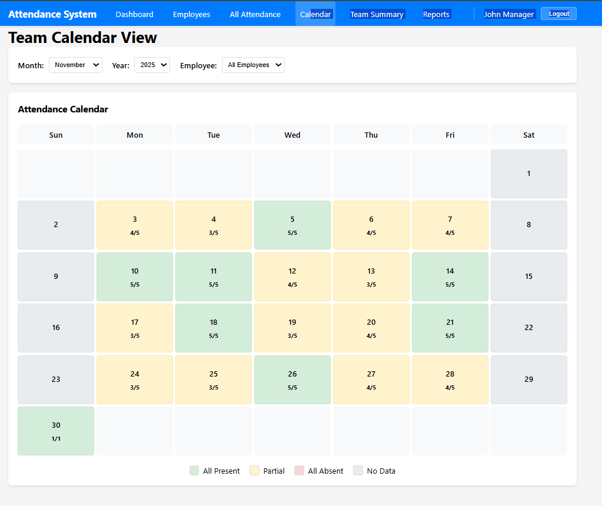

# Employee Attendance System

A full-stack attendance tracking system with role-based access for employees and managers.

## Tech Stack

- **Frontend**: React + Redux Toolkit
- **Backend**: Node.js + Express
- **Database**: MongoDB
- **Authentication**: JWT

## Features

### Employee Features
- ✅ Register/Login
- ✅ Mark attendance (Check In / Check Out)
- ✅ View attendance history (calendar or table view)
- ✅ View monthly summary (Present/Absent/Late days)
- ✅ Dashboard with stats

### Manager Features
- ✅ Login
- ✅ View all employees attendance
- ✅ Filter by employee, date, status, department
- ✅ View team attendance summary
- ✅ Export attendance reports (CSV)
- ✅ Dashboard with team stats
- ✅ Team calendar view

## Project Structure

```
.
├── backend/
│   ├── models/          # MongoDB models (User, Attendance)
│   ├── routes/          # API routes (auth, attendance, dashboard)
│   ├── middleware/     # Authentication middleware
│   ├── scripts/         # Seed data script
│   └── server.js        # Express server
├── frontend/
│   ├── src/
│   │   ├── components/  # Reusable components
│   │   ├── pages/       # Page components
│   │   ├── store/       # Redux store and slices
│   │   └── App.js       # Main app component
│   └── public/          # Public assets
└── README.md
```

## Quick Start

### Prerequisites
- Node.js (v14 or higher)
- MongoDB (local or Atlas)
- npm or yarn

### Quick Setup (5 minutes)

**1. Backend Setup:**
```bash
cd backend
npm install
cp env.example .env
# Edit .env with your MongoDB URI
npm run seed  # Creates sample data
npm run dev    # Starts server on port 5000
```

**2. Frontend Setup:**
```bash
cd frontend
npm install
npm start      # Starts on port 3000
```

**3. Login Credentials:**
- **Manager**: manager@company.com / manager123
- **Employee**: alice@company.com / employee123

## Setup Instructions

### Prerequisites
- Node.js (v14 or higher)
- MongoDB (local installation or MongoDB Atlas)
- npm or yarn

### Backend Setup

1. Navigate to the backend directory:
```bash
cd backend
```

2. Install dependencies:
```bash
npm install
```

3. Create a `.env` file in the backend directory:
```env
PORT=5000
MONGODB_URI=mongodb://localhost:27017/attendance_system
JWT_SECRET=your_super_secret_jwt_key_change_this_in_production
NODE_ENV=development
```

4. Start MongoDB (if running locally):
```bash
# On Windows
mongod

# On Mac/Linux
sudo systemctl start mongod
# or
brew services start mongodb-community
```

5. Seed the database with sample data:
```bash
npm run seed
```

6. Start the backend server:
```bash
# Development mode
npm run dev

# Production mode
npm start
```

The backend server will run on `http://localhost:5000`

### Frontend Setup

1. Navigate to the frontend directory:
```bash
cd frontend
```

2. Install dependencies:
```bash
npm install
```

3. Create a `.env` file in the frontend directory (optional):
```env
REACT_APP_API_URL=http://localhost:5000/api
```

4. Start the development server:
```bash
npm start
```

The frontend will run on `http://localhost:3000`

## Environment Variables

### Backend (.env)
- `PORT` - Server port (default: 5000)
- `MONGODB_URI` - MongoDB connection string
- `JWT_SECRET` - Secret key for JWT tokens
- `NODE_ENV` - Environment (development/production)

### Frontend (.env)
- `REACT_APP_API_URL` - Backend API URL (default: http://localhost:5000/api)

## Default Login Credentials

After running the seed script, you can use these credentials:

### Manager
- **Email**: manager@company.com
- **Password**: manager123

### Employee
- **Email**: alice@company.com (or bob@company.com, carol@company.com, etc.)
- **Password**: employee123

## API Endpoints

### Authentication
- `POST /api/auth/register` - Register new user
- `POST /api/auth/login` - Login user
- `GET /api/auth/me` - Get current user

### Attendance (Employee)
- `POST /api/attendance/checkin` - Check in
- `POST /api/attendance/checkout` - Check out
- `GET /api/attendance/today` - Get today's status
- `GET /api/attendance/my-history` - Get attendance history
- `GET /api/attendance/my-summary` - Get monthly summary

### Attendance (Manager)
- `GET /api/attendance/all` - Get all employees attendance
- `GET /api/attendance/employee/:id` - Get specific employee attendance
- `GET /api/attendance/summary` - Get team summary
- `GET /api/attendance/today-status` - Get today's attendance status
- `GET /api/attendance/export` - Export CSV

### Dashboard
- `GET /api/dashboard/employee` - Employee dashboard stats
- `GET /api/dashboard/manager` - Manager dashboard stats

## Database Schema

### User
```javascript
{
  name: String,
  email: String (unique),
  password: String (hashed),
  role: String (employee/manager),
  employeeId: String (unique),
  department: String,
  createdAt: Date
}
```

### Attendance
```javascript
{
  userId: ObjectId (ref: User),
  date: Date,
  checkInTime: Date,
  checkOutTime: Date,
  status: String (present/absent/late/half-day),
  totalHours: Number,
  createdAt: Date
}
```

## Features in Detail

### Employee Dashboard
- Today's attendance status
- Monthly statistics (Present/Absent/Late)
- Total hours worked
- Recent attendance (last 7 days)
- Quick check-in/out button

### Manager Dashboard
- Total employees count
- Today's attendance overview
- Late arrivals tracking
- Weekly attendance trend chart
- Department-wise attendance chart
- List of absent employees

### Attendance History
- Calendar view with color coding
- Table view with detailed records
- Monthly filter
- Status indicators (Present/Absent/Late/Half-day)

### Reports
- Date range filtering
- Employee/Department filtering
- Status filtering
- CSV export functionality

## Screenshots

### Employee Dashboard

*Employee dashboard showing today's status, monthly statistics (Present: 16, Absent: 2, Late: 2), and recent attendance history for the last 7 days with check-in/check-out times.*

### Manager Dashboard

*Manager dashboard displaying total employees (5), today's attendance summary (Present: 1, Absent: 4, Late: 1), weekly attendance trend chart, department-wise attendance bar chart, list of absent employees, and department overview with employee counts.*

### Team Calendar View

*Team calendar view showing monthly attendance calendar with color-coded status indicators. Green indicates all employees present, yellow indicates partial attendance, and gray indicates no data. Each day shows the date and attendance ratio (e.g., 5/5 means 5 out of 5 employees present).*

### Attendance Reports

*Attendance reports page with comprehensive filtering options (date range, employee ID, status, department), detailed attendance table showing employee information, check-in/check-out times, status badges, and CSV export functionality.*

> **Note**: Add your screenshot images to the `screenshots/` folder with these exact names:
> - `employee-dashboard.png` - Employee Dashboard
> - `manager-dashboard.png` - Manager Dashboard  
> - `calendar-view.png` - Team Calendar View
> - `reports.png` - Attendance Reports

## Documentation

- **[API Documentation](API_DOCUMENTATION.md)** - Complete API reference with all endpoints, request/response examples, and error codes
- **[Code Quality Standards](CODE_QUALITY.md)** - Coding standards, best practices, and code review checklist
- **[Troubleshooting Guide](TROUBLESHOOTING.md)** - Common issues, solutions, and debugging tips

## How to Run

### Development Mode

**1. Start Backend Server:**
```bash
cd backend
npm run dev
```
The backend will run on `http://localhost:5000`

**2. Start Frontend Server:**
```bash
cd frontend
npm start
```
The frontend will automatically open in your browser at `http://localhost:3000`

**3. Access the Application:**
- Open your browser and navigate to `http://localhost:3000`
- Login with the credentials provided in the "Default Login Credentials" section

### Production Build

**Build Frontend:**
```bash
cd frontend
npm run build
```
The production-ready files will be in the `build` folder.

**Run Backend in Production:**
```bash
cd backend
npm start
```

### Running Both Servers

You need to run both backend and frontend servers simultaneously:
1. Open two terminal windows
2. In the first terminal, run the backend: `cd backend && npm run dev`
3. In the second terminal, run the frontend: `cd frontend && npm start`

## Additional Resources

For detailed troubleshooting steps and solutions, see the [Troubleshooting Guide](TROUBLESHOOTING.md).
- Check JWT_SECRET in backend .env
- Verify token is being sent in request headers

## Contributing

1. Fork the repository
2. Create a feature branch
3. Make your changes
4. Submit a pull request

## License

This project is open source and available under the MIT License.

## Author

Built as part of TAP Academy project.

---

**Note**: Make sure to change the JWT_SECRET in production and use strong passwords for database connections.

##NAME: DARSHAN C S
COLLEGE: ATME COLLEGE FO ENGINEERING, MYSORE
PH NO: 8660733408
